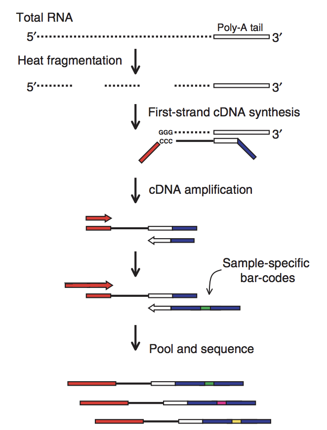

# Calling genomic variants from 3' Tag Sequencing Data

## Introduction and reasoning
More and more, 3' tag sequencing (tag-seq) is being used as an alternative to traditional RNA sequencing to asses the transcriptional profile of samples. Tag-seq focusses the sequencing effort to the 3' end of a transcript, and in doing so requires less coverage to quantitatively determine expression levels for a gene. This means that one can expend less sequencing effort per sample to achieve similar concusions as traditional RNAseq. 

{:height="50%" width="50%"}

One thing that biologists interested in hybridization and heterosis are interested in is assessing the contribution of each parent to the overall transcriptional state of the offspring organism. To do this with tranditional RNAseq, one would find meaninful SNPs that define an allele, then map the reads back to the genomes and figure out how many reads map to these alleles that define the parental genomes. 

Because the sequencing effort is limited to the 3' end of the transcripts in tag-seq, I want to see here if it is feasible to use tag-seq to define parent of origin expression. In this example, I use tag-seq data from the parents of the Arabidopsis thaliana MAGIC lines to call variants.

## Data Processing

### Trimming sequencing results
Tag-seq reads originate mainly in the 3' UTR of transcripts, therefore many of the reads contain the polyA tail. This part needs to be trimmed off. I have written a python script `fq_trim.py` that will do this. Not only that, but with tag-seq data, it is important to trim the first 12 bases of the reads because they originate from random primers and likely have some mismatched bases from the reference genome. But before trimming, let's get everything in order so that we can automate the process.

I took some time to get a file together with unique identifying information for each fastq file so that I could write a quick shell script to automate some of the stuff. For example:

Original File | Unique identifier
------------- | -----------------
IMCK_tagseq_EVSPool2_Rsch-1_Juenger-7_I789_L2_R1.fastq | Pool2_Rsch-1
IMCJ_tagseq_EVSPool1_Bur-6_Juenger-3_I789_L1_R1.fastq | Pool1_Bur-6

Next we can loop over each file to trim it accordingly. Note that the the `-n` option is set to 25 here. This means that if after trimming away the polyA tail and there is less than 25 bases left, the program will discard the read. One may have to play with this option to see what they like the best.

```
for sample in $(cat samples); \
do echo "On sample: $sample"; fq_trim.py -i *"$sample"* -n 15 -o "$sample"_trim.fq;
done;
```
### Aligning reads
Now that everything is trimmed down to remove the polyA tail we can align the reads to the genome. I think it is best to call SNPs verse one well-annotated genome, so in this case I am using the TAIR10 Columbia reference genome. We will do the aligning in the splice-aware manner because the reads can cover a few exons as well as the 3' UTR.

I'll align to the col genome using Bowtie2 + Tophat. Before aligning, bowtie2 needs to index the reference genome. You can do this with the below code.
```
bowtie2 index TAIR10_chr_all.fas at
```

`TAIR10_chr_all.fas` is the input fasta file and `at` is the prefix that will be put on the created index files. Next we will align the reads for each fastq file to the col genome.

```
for sample in $(cat samples); \
do echo "On sample: $sample"; \
tophat -o "$sample"_th /Users/joeya/JOE/reference/at "$sample"_trim.fq; \
done;
```
This will output all kinds of stuff, but we are mainly interested in is the `accepted_hits.bam` it spits out. This file needs to be sorted before continuing.

```
for sample in $(cat samples); \
do echo "On sample: $sample"; \
samtools sort "$sample"_th/accepted_hits.bam > "$sample"_sorted.bam; \
done;
```

Now we are ready to call variants

### Calling variants
We will use the mpileup command out of bcftools to 
